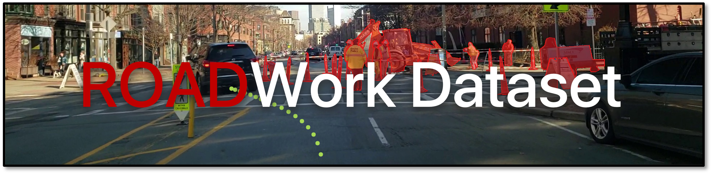
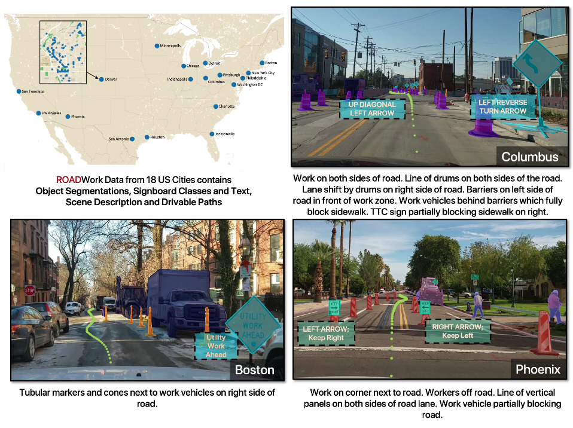

Please visit [ROADWork Dataset](https://www.cs.cmu.edu/~ILIM/roadwork_dataset/) for information about our dataset.

This dataset contains various annotated images and videos related to roadwork scenes. The data is organized into multiple zip files, and the zip files can be downloaded from [CMU Kilthub](https://doi.org/10.1184/R1/26093197). Below you will find a detailed description of each file and instructions for their usage.



## Directory structure

We suggest the following directory structure.
```
├── pathways
│   ├── annotations
│   └── images
├── scene
│   ├── annotations
│   ├── images
│   └── sem_seg
│       ├── gtFine
│       │   ├── train
│       │   └── val
│       └── images
│           ├── train
│           └── val
└── videos
```

## Dataset Files

Dataset can be downloaded from [CMU Kilthub](https://doi.org/10.1184/R1/26093197).

`images.zip`
- **Description:** Contains all the ROADWork images that have been manually annotated.
- **Usage:** 
  - We suggest storing these images in scene/images/
  - Images collected by us (`<image_name>.jpg`) are formatted as `pgh<seq_id>_<frame_id>.jpg`
  - Images mined from Roadbotics data (`<image_name>.jpg`) are formatted as `<city_name>_<sequence_id>_<video_id>_<frame_id>.jpg`

`annotations.zip`
- **Description:** Contains instance segmentations, sign information, scene descriptions, and other labels for images in `images.zip` in a COCO-like format. It contains multiple splits, suited for different tasks.
- **Usage:** 
  - The annotations follow an extension of the COCO format, please see [COCO](https://cocodataset.org/#format-data) for details.
  - Image level attributes are stored in `image` struct while additional object level attributes are stored in `annotation` struct in the JSON files.
  - Many different splits are provided for supervised, semi-supervised and unsupervised training:
    - `instances_<train/val>_gps_split.json`: Both train and val have images from all the cities, but they have been split to ensure none of the images in the split are within 100m of each other.
    - `instances_<train/val>_gps_split_with_signs.json`: Same as above but the class vocabulary is expanded to include rare sign information.
    - `instances_<train/val>_pittsburgh_only.json`: Training images are from Pittsburgh Only, while the validation images include images from all the other cities (and NO Pittsburgh images).
    - `instances_geographic_da_{pretrain/unsupervised_with_gt/test}.json`: This is the split to be used for geographic domain adaptation. Pretrain images labels can be used for training (and represent source domain images from Pittsburgh only). Unsupervised split contains images and labels from other cities but the labels should not be used for training if unsupervised domain adaptation is being evaluated. Test split contains images from the all cities (Pittsburgh and other cities) for evaluation only.

`sem_seg_labels.zip`
- **Description:** Contains semantic segmentation labels for images in `images.zip` in the Cityscapes format.
- **Usage:**
  - They are named in the same format as images/ and stored in scene/gtFine/ folder.
  - The split is the same as `gps_split` mentioned earlier.
  - For each image, three files have been generated following the CityScapes format
    - `<image_name>_labelColors.png`
    - `<image_name>_labelIds.png`
    - `<image_name>_Ids.png`
  - `segm-visualize.ipynb` has the code snippet for setting up the images symlinks.

`discovered_images.zip`
- **Description:** Contains discovered images with roadwork scenes from BDD100K and Mapillary dataset (less than 1000 images in total). These images are provided for ease of access ONLY.
- **Usage:** Utilize these images for auxiliary tasks. Note the specific license information for these external datasets.

`traj_images.zip`
- **Description:** Contains images associated with pathways. These images were manually filtered to contain ground truth pathways obtained from COLMAP. The split is the same `gps_split` to avoid data contamination from models trained on `images.zip`.
- **Usage:** 
  - Format: `<city_name>_<sequence_id>_<video_id>_<frame_id>_<relative_frame_id>.jpg`
  - The snippets were sampled at 5 FPS, so a total of 150 frames were sampled for 3D reconstruction (which is the `<relative_frame_id>`).
  - The `frame_id` corresponds to the 15th second of the 30 second snippet that was extracted (thus it is the 75th frame of the sequence).
  - The pathways for all these images were manually verified.

`traj_annotations.zip`
- **Description:** Contains pathway annotations corresponding to images in `traj_images.zip`.
- **Usage:** 
  - Pair these annotations with `traj_images.zip`.
  - Split is following the "gps_split" described above.

`traj_images_dense.zip`
- **Description:** Contains a dense set of images with associated pathways. These are similar to `traj_images.zip` but are not subsampled.
- **Usage:** Same as `traj_images.zip`.
  - The snippets were sampled at 5 FPS, so a total of 150 frames were sampled for 3D reconstruction.
  - Pathway images _temporally between_ two or more verified images from `traj_images.zip` all sampled to provide 5 FPS pathway sequences longer than 10 frames.

`traj_annotations_dense.zip`
- **Description:** Contains pathway annotations corresponding to images in `traj_images_dense.zip`.
- **Usage:** Same as `traj_annotations.zip`.

`videos_compressed.zip`
- **Description:** Contains video snippets from the Robotics Open Dataset that were used to compute 3D reconstructions and then pathways using COLMAP.
- **Usage:** 
  - Please also download videos_compressed.z{00..07} to unzip this file.
  - Format: `<city_name>_<sequence_id>_<video_id>_<frame_id>.mp4`

## Scripts

Example scripts showing how to use the dataset and run the models. We have provided an `environment.yaml` to create a conda environment for running these models.

`instance-visualize.ipynb`
- **Description:** Visualizes instance segmentation ground truth and model trained on ROADWork dataset.
- **Notes:** We use [mmdetection](https://github.com/open-mmlab/mmdetection) to train our models. Dataloader is provided in the notebook.

`segm-visualize.ipynb`
- **Desciption:** Visualizes semantic segmentation ground truth and model trained on ROADWork dataset.
- **Notes:** We use [segmentation_models.pytorch](https://github.com/qubvel/segmentation_models.pytorch) to train our models. Dataloader is provided in the notebook.

`description-visualize.ipynb`
- **Desciption:** Visualizes description ground truth and LLaVA LORA model trained on ROADWork dataset. Dataloader is provided in the notebook.

`pathways-visualize.ipynb`
- **Desciption:** Visualizes pathways ground truth and model trained on ROADWork dataset. Dataloader is provided in the notebook.

## License Information

Please note that the `discovered_images.zip` file contains images from the BDD100K and Mapillary datasets, which are subject to their respective licenses. Ensure compliance with these licenses when using these images.

## Citation

If you use this dataset in your research, please cite:

```
@article{ghosh2024roadwork,
  title={ROADWork Dataset: Learning to Recognize, Observe, Analyze and Drive Through Work Zones},
  author={Ghosh, Anurag and Tamburo, Robert and Zheng, Shen and Alvarez-Padilla, Juan R and Zhu, Hailiang and Cardei, Michael and Dunn, Nicholas and Mertz, Christoph and Narasimhan, Srinivasa G},
  journal={arXiv preprint arXiv:2406.07661},
  year={2024}
}
```

## Contact

For any questions or support, please contact [Anurag Ghosh](https://anuragxel.github.io).

Thank you for using the ROADWork dataset. We hope it contributes significantly to your research and development projects.