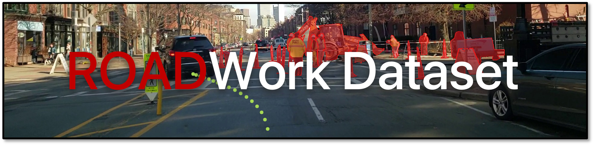
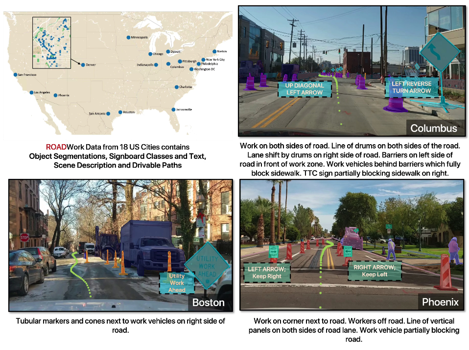

---

<div align="center">

# [ICCV 2025] ROADWork: <br> A Dataset and Benchmark for Learning to Recognize, Observe, Analyze and Drive Through Work Zones

[Anurag Ghosh](https://anuragxel.github.io/), [Shen Zheng](https://shenzheng2000.github.io/), [Robert Tamburo](https://www.ri.cmu.edu/ri-people/robert-joseph-tamburo/), [Khiem Vuong](https://www.khiemvuong.com/), [Juan Alvarez-Padilla](https://juanalvarezpadilla.com/),
[Hailiang Zhu](https://zhuhl0913.github.io/), [Michael Cardei](https://michaelcardei.github.io/), [Nicholas Dunn](https://www.linkedin.com/in/nicholas-dunn-3997011bb), [Christoph Mertz](https://www.ri.cmu.edu/ri-people/christoph-mertz/) and [Srinivasa Narasimhan](https://www.cs.cmu.edu/~srinivas/)

<a href='https://openaccess.thecvf.com/content/ICCV2025/papers/Ghosh_ROADWork_A_Dataset_and_Benchmark_for_Learning_to_Recognize_Observe_ICCV_2025_paper.pdf'></a>&nbsp;
<a href='https://arxiv.org/abs/2406.07661'></a>&nbsp;
<a href='https://www.cs.cmu.edu/~ILIM/roadwork_dataset/'></a>&nbsp;


</div>


## 🤗 Overview
<!-- Please visit [ROADWork Dataset](https://www.cs.cmu.edu/~ILIM/roadwork_dataset/) for information about our dataset. -->

<!-- This dataset contains various annotated images and videos related to roadwork scenes. The data is organized into multiple zip files, and the zip files can be downloaded from [CMU Kilthub](https://doi.org/10.1184/R1/26093197). Baseline models can be downloaded from [Google Drive](https://drive.google.com/file/d/1FbmIt24FfGu4kKMMp-IZUqS-jHt3Rshx/view?usp=sharing). -->

ROADWork is a large-scale open-source dataset and benchmark with fine-grained annotations and scene descriptions for challenging real-world roadwork driving environments, designed to improve perception and navigation in construction zones.

The dataset contains **4,375 videos, 9,650 fully annotated images**, and **129K path-annotated images**, covering 15 object categories and 360 unique roadwork signs across 18 U.S. cities, with additional in-the-wild images from around the world.

* Dataset: [CMU KiltHub](https://doi.org/10.1184/R1/26093197)
* Alternative Link [HuggingFace](https://huggingface.co/datasets/anuragxel/roadwork-dataset)
* Baseline models: [Google Drive](https://drive.google.com/file/d/1FbmIt24FfGu4kKMMp-IZUqS-jHt3Rshx/view?usp=sharing)

<br>




## 📋 Table of Contents

- [Directory Structure](#-directory-structure)
- [Dataset](#-dataset)
- [Models](#-models)
- [Scripts](#-scripts)
- [License](#-license)
- [Citation](#-citation)
- [Contact](#-contact)


## 📂 Directory Structure

The dataset is organized as follows (after extraction):
```
├── pathways
│   ├── annotations
│   └── images
├── scene
│   ├── annotations
│   ├── images
│   └── sem_seg
│       ├── gtFine
│       │   ├── train
│       │   └── val
│       └── images
│           ├── train
│           └── val
└── videos
```


## 📥 Dataset

The dataset is available on [CMU KiltHub](https://doi.org/10.1184/R1/26093197) and is organized into multiple zip files.

<!-- We provide brief description of each zip file here. -->


### 🖼️ 1. Scene Data
<details>
<summary>images.zip</summary>

- **Description:** Contains all the ROADWork images that have been manually annotated.
- Unzip in `/scene/`.
- **Usage:** 
  - Images collected by us (`<image_name>.jpg`) are formatted as `pgh<seq_id>_<frame_id>.jpg`
  - Images mined from Roadbotics data (`<image_name>.jpg`) are formatted as `<city_name>_<sequence_id>_<video_id>_<frame_id>.jpg`

</details>


<details>
<summary>annotations.zip</summary>

- **Description:** Contains instance segmentations, sign information, scene descriptions, and other labels for images in `images.zip` in a COCO-like format. It contains multiple splits, suited for different tasks.
- Unzip in `/scene/`.
- **Usage:** 
  - The annotations follow an extension of the COCO format, please see [COCO](https://cocodataset.org/#format-data) for details.
  - Image level attributes are stored in `image` struct while additional object level attributes are stored in `annotation` struct in the JSON files.
  - Many different splits are provided for supervised, semi-supervised and unsupervised training:
    - `instances_<train/val>_gps_split.json`: Both train and val have images from all the cities, but they have been split to ensure none of the images in the split are within 100m of each other.
    - `instances_<train/val>_gps_split_with_signs.json`: Same as above but the class vocabulary is expanded to include rare sign information.
    - `instances_<train/val>_pittsburgh_only.json`: Training images are from Pittsburgh Only, while the validation images include images from all the other cities (and NO Pittsburgh images).
    - `instances_geographic_da_{pretrain/unsupervised_with_gt/test}.json`: This is the split to be used for geographic domain adaptation. Pretrain images labels can be used for training (and represent source domain images from Pittsburgh only). Unsupervised split contains images and labels from other cities but the labels should not be used for training if unsupervised domain adaptation is being evaluated. Test split contains images from the all cities (Pittsburgh and other cities) for evaluation only.

</details>


<details>
<summary>sem_seg_labels.zip</summary>

- **Description:** Contains semantic segmentation labels for images in `images.zip` in the Cityscapes format.
- Unzip in `/scene/sem_seg`.
- **Usage:**
  - They are named in the same format as images/ and stored in scene/gtFine/ folder.
  - The split is the same as `gps_split` mentioned earlier.
  - For each image, three files have been generated following the CityScapes format
    - `<image_name>_labelColors.png`
    - `<image_name>_labelIds.png`
    - `<image_name>_Ids.png`
  - `segm-visualize.ipynb` has the code snippet for setting up the images symlinks.

</details>


<details>
<summary>discovered_images.zip</summary>

- **Description:** Contains discovered images with roadwork scenes from BDD100K and Mapillary dataset (less than 1000 images in total). These images are provided for ease of access ONLY.
- Unzip in `/discovered/`.
- **Usage:** Utilize these images for auxiliary tasks. Note the specific license information for these external datasets.

</details>


### 🛣️ 2. Pathway Data
<details>
<summary>traj_images.zip</summary>

- **Description:** Contains images associated with pathways. These images were manually filtered to contain ground truth pathways obtained from COLMAP. The split is the same `gps_split` to avoid data contamination from models trained on `images.zip`.
- Unzip in `/pathways/`.
- **Usage:** 
  - Format: `<city_name>_<sequence_id>_<video_id>_<frame_id>_<relative_frame_id>.jpg`
  - The snippets were sampled at 5 FPS, so a total of 150 frames were sampled for 3D reconstruction (which is the `<relative_frame_id>`).
  - The `frame_id` corresponds to the 15th second of the 30 second snippet that was extracted (thus it is the 75th frame of the sequence).
  - The pathways for all these images were manually verified.

</details>


<details>
<summary>traj_annotations.zip</summary>

- **Description:** Contains pathway annotations corresponding to images in `traj_images.zip`.
- Unzip in `/pathways/`.
- **Usage:** 
  - Pair these annotations with `traj_images.zip`.
  - Split is following the "gps_split" described above.

</details>


<details>
<summary>traj_images_dense.zip</summary>

- **Description:** Contains a dense set of images with associated pathways. These are similar to `traj_images.zip` but are not subsampled.
- Unzip in `/pathways_dense/`.
- **Usage:** Same as `traj_images.zip`.
  - The snippets were sampled at 5 FPS, so a total of 150 frames were sampled for 3D reconstruction.
  - Pathway images _temporally between_ two or more verified images from `traj_images.zip` all sampled to provide 5 FPS pathway sequences longer than 10 frames.

</details>


<details>
<summary>traj_annotations_dense.zip</summary>

- **Description:** Contains pathway annotations corresponding to images in `traj_images_dense.zip`.
- Unzip in `/pathways_dense/`.
- **Usage:** Same as `traj_annotations.zip`.

</details>


### 📦 3. Other Data
<details>
<summary>videos_compressed.zip</summary>

- **Description:** Contains video snippets from the Robotics Open Dataset that were used to compute 3D reconstructions and then pathways using COLMAP.
- Unzip in `/videos/`.
- **Usage:** 
  - Please also download videos_compressed.z{00..07} to unzip this file.
  - Format: `<city_name>_<sequence_id>_<video_id>_<frame_id>.mp4`

</details>

## 🤖 Models

<!-- Baseline Models are provided at this [Google Drive](https://drive.google.com/file/d/1FbmIt24FfGu4kKMMp-IZUqS-jHt3Rshx/view?usp=sharing) link. Unzip `roadwork_baseline_models.zip` in the base directory and place all models in the `./models/` directory.

Example scripts are provided as Jupyter Notebooks showing how to use the dataset, run the models and visualize the results. We have provided an `environment.yaml` to create a conda environment for running these models. For `description-visualize.ipynb`, we instead provide `llava_environment.yaml` but suggest following the steps mentioned below. -->

We provide baseline models and environment configurations to help you get started.
* **Models**: Download from [Google Drive](https://drive.google.com/file/d/1FbmIt24FfGu4kKMMp-IZUqS-jHt3Rshx/view?usp=sharing), unzip `roadwork_baseline_models.zip` in the root directory, and place models in `./models/`.
* **Environment**: Use `environment.yaml` for standard setup, or `llava_environment.yaml` for `description-visualize.ipynb`.


## 🛠️ Scripts

We also provide a set of Jupyter notebooks for visualizing annotations and running models across different tasks in the ROADWork dataset.


<details>
<summary>instance-visualize.ipynb</summary>

- **Description:** Visualizes instance segmentation ground truth and model trained on ROADWork dataset.
- **Notes:** We use [mmdetection](https://github.com/open-mmlab/mmdetection) to train our models. Dataloader is provided in the notebook.

</details>


<details>
<summary>segm-visualize.ipynb</summary>

- **Desciption:** Visualizes semantic segmentation ground truth and model trained on ROADWork dataset.
- **Notes:** We use [segmentation_models.pytorch](https://github.com/qubvel/segmentation_models.pytorch) to train our models. Dataloader is provided in the notebook.

</details>


<details>
<summary>pathways-visualize.ipynb</summary>

- **Desciption:** Visualizes pathways ground truth and model trained on ROADWork dataset. Dataloader is provided in the notebook.

</details>


<details>
<summary>description-visualize.ipynb</summary>

- **Desciption:** Visualizes description ground truth and LLaVA LORA model trained on ROADWork dataset. Dataloader is provided in the notebook.
- **Usage:** LLaVA is a large package so we don't include it in our repository.
  - Install LLaVA. 
    - Clone LLaVA `git clone https://github.com/haotian-liu/LLaVA.git` inside misc/ folder
    - Checkout LLaVA code version v1.1.3 `git checkout tags/v1.1.3`
    - Follow the installation process from `README.md` and create a `llava` conda environment.
  - Download the LLaVA-1.5-7B model.
    - Install git-lfs `sudo apt-get install git-lfs`
    - In `./models/llava_scene_description/` download the model by
      - `git-lfs install` or `git lfs install` 
      - `git clone https://huggingface.co/liuhaotian/llava-v1.5-7b`
      - or `git clone git@hf.co:liuhaotian/llava-v1.5-7b`
- **Optional**: Merge LORA's with the LLaVA-1.5-7B model. 
  - `cd misc/LLaVA/scripts/`
  - `python merge_lora_weights.py --model-path ../../../models/llava_scene_description/llava_lora/captions-workzone-llava-v1.5-7b-lora --model-base ../../../models/llava_scene_description/llava-v1.5-7b --save-model-path ../../../models/llava_scene_description/llava-with-context-workzone/`

</details>


<details>
<summary>explore-roadwork-data.ipynb</summary>

- **Desciption:** Visualizes semantic segmentation ground truth and model trained on ROADWork dataset.

</details>

## ROADWork-But-German-Annotations

<details>
Sebastian Wullrich has helpfully provided us with re-annotated ROADWork dataset with German object annotations which can be useful for studying out-of-domain detection. 

They are provided as-is here: [Hugging Face Link](https://huggingface.co/datasets/anuragxel/roadwork-dataset/tree/main/german)

We have also provided their AutoNOMOS dataset containing work zone images from Germany for ease-of-access.

If you use any of the AutoNOMOS datasets (including ROADWork-But-German-Annotations) in your research, please cite the following:
```
@article{wullrich2026deep,
  title={Deep Neural Network Based Roadwork Detection for Autonomous Driving},
  author={Wullrich, Sebastian and Steinke, Nicolai and Goehring, Daniel},
  journal={arXiv preprint arXiv:2604.02282},
  year={2026}
}
```
</details>

<!-- ## Coming Soon

- Scripts to compute all the metrics easily. -->

## 📜 License

The code is licensed under the MIT License. The ROADWork dataset is licensed under the [Open Data Commons Attribution License v1.0](https://opendatacommons.org/licenses/by/1-0/).

Note that `discovered_images.zip` contains images from the BDD100K and Mapillary datasets, which are subject to their respective licenses. Please ensure compliance when using these images.

The ROADWork-But-German Dataset Annotations (excluding ROADWork images) and AutoNOMOS Labs Dataset are licensed under [CC BY-NC-SA 4.0](https://creativecommons.org/licenses/by-nc-sa/4.0/deed.en).

## ✍️ Citation

If you use the ROADWork dataset in your research, please cite the following:

```
@inproceedings{ghosh2025roadwork,
  title={Roadwork: A dataset and benchmark for learning to recognize, observe, analyze and drive through work zones},
  author={Ghosh, Anurag and Zheng, Shen and Tamburo, Robert and Vuong, Khiem and Alvarez-Padilla, Juan and Zhu, Hailiang and Cardei, Michael and Dunn, Nicholas and Mertz, Christoph and Narasimhan, Srinivasa G},
  booktitle={ICCV},
  year={2025}
}
```

## 🤝 Contact

For questions or support, please open an issue or contact [Anurag Ghosh](https://anuragxel.github.io).

<!-- Thank you for using the ROADWork dataset. We hope it contributes significantly to your research and development projects. -->

We hope the ROADWork dataset supports your research and development.
